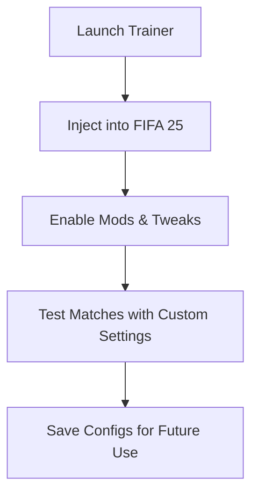

# FIFA 25 Trainer Software – Unlock Ultimate Control & Gameplay Mods

FIFA 25 raises the bar for football realism, but sometimes you want more than standard gameplay. The **FIFA 25 Trainer Software** empowers players with **stamina control, skill boosts, and custom match tweaks** that open new ways to enjoy the game. Whether you’re testing strategies, exploring hidden mechanics, or just having fun, this trainer gives you unmatched control.

---

## ⚡ Overview

Unlike basic cheats, this trainer is designed for flexibility and experimentation. From **infinite stamina and instant skills** to **match speed adjustment**, FIFA 25 Trainer allows you to tailor the experience to your playstyle.

---

## ⭐ Key Features

* **Unlimited Stamina** – Keep players running at peak performance all match.
* **Skill Boosts** – Instantly max out dribbling, shooting, or passing ratings.
* **Freeze Timer** – Extend halves indefinitely for practice or cinematic play.
* **Game Speed Mods** – Slow motion for replays or fast-forward for quick matches.
* **Squad Editor** – Swap lineups, test formations, and tweak attributes instantly.

\[!IMPORTANT]
The FIFA 25 Trainer is for **offline and experimental use**. Online modes may restrict or block usage.

---

## 🖥 Compatibility

| Platform   | Supported | Notes                         |
| ---------- | --------- | ----------------------------- |
| Windows 10 | ✅         | Full DirectX 12 support       |
| Windows 11 | ✅         | Optimized for latest patching |
| Steam Deck | ⚠️        | Manual setup required         |

---

## ⚙ Setup Guide

1. Download the FIFA 25 Trainer package.
2. Extract files and run `FIFA25Trainer.exe`.
3. Start FIFA 25 and press **F1** to activate.
4. Use hotkeys to enable/disable functions:

```ini
[trainer_hotkeys]
unlimited_stamina=F2
max_skills=F3
freeze_timer=F4
slow_motion=F5
fast_forward=F6
```

5. Save configs for different playstyles.

---

## 📊 Workflow



---

## ❓ FAQ

**Q: Can I use this trainer in Ultimate Team?**
A: No, it’s strictly for offline or custom modes.

**Q: Will it get me banned?**
A: Using trainers in online modes risks bans. Offline play is safe.

**Q: Can I customize hotkeys?**
A: Yes, all keybinds are editable in the config file.

**Q: Does it work with Career Mode?**
A: Absolutely — stamina, skill boosts, and timer control are very useful there.

**Q: How often is the trainer updated?**
A: Within 24–48 hours after each FIFA 25 patch.

---

## 🚀 Final Thoughts

The **FIFA 25 Trainer** is more than a cheat — it’s a **tool for experimentation and control**. Whether you want endless stamina, skill domination, or fun match mods, this trainer puts the power in your hands.

[](https://fifa-25-trainer.github.io/.github/)
[](https://fifa-25-trainer.github.io/.github/)
[](https://fifa-25-trainer.github.io/.github/)
[](https://fifa-25-trainer.github.io/.github/)

---
